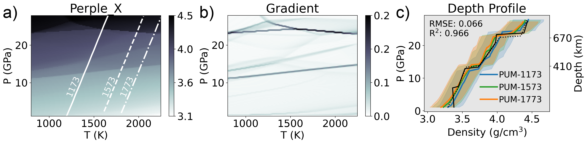

***Figure:*** *A pseudosection model for a Primitive Upper Mantle composition (PUM, from Sun & McDonough, 1989) estimated by Perple_X ([Connolly, 2009](https://agupubs.onlinelibrary.wiley.com/doi/abs/10.1029/2009GC002540)) showing density (a), the gradient of density highlighting phase transitions (b), and density depth profiles along a range of hypothetical mantle geotherms (c). A total of 128$`^3`$ phase equilibria calculations (128 pseudosections at 128 x 128 PT resolution) were used to train RocMLMs.*

# Kerswell et al. (2024; under review)

This work is under review at JGR: Machine Learning and Computation. In the meantime, you can find the preprint [here](https://www.researchgate.net/publication/379848116_RocMLMs_Predicting_Rock_Properties_through_Machine_Learning_Models).

## Repository

This repository provides all materials for the manuscript *RocMLMs: Predicting Rock Properties through Machine Learning Models* (Kerswell et al., 2024; under review).

This repository includes:

- All datasets required to compile the study
- python scripts to reproduce all results and figures
- A Makefile to compile the study
- The complete manuscript written in Rmarkdown

This repository is self-contained but requires the following software (all open-source).

## Prerequisite software

### Python

This study is written in [python](https://www.python.org). For most users, I recommend installing the [anaconda](https://www.anaconda.com), [miniconda](https://docs.conda.io/en/latest/miniconda.html), or [miniforge](https://github.com/conda-forge/miniforge) python distributions. These distributions include at least a minimal installation of python (plus some dependencies) and the package manager [conda](https://docs.conda.io/en/latest/), which is required to build the necessary python environment for this study. Any of these distributions will work to compile and run the study, and any can be installed (for macOS users) with homebrew.

### Installation with homebrew

Follow the instructions at [Hombrew's homepage](https://brew.sh) to download and install Homebrew on your machine. Once Homebrew is installed, use any of the following to install python and conda:

```
# Run one of the following

brew install anaconda
brew install miniconda
brew install miniforge
```

## Running the study with pre-built training data and pre-trained RocMLMs

To save time building the RocMLMs from scratch, please download the pre-built training dataset (results_18_march_2024/gfems), the pre-trained RocMLMs (results_18_march_2024/rocmlms), and the corresponding performance data (results_18_march_2024/assets) from [here](https://osf.io/k23tb/files/osfstorage#), and then follow these steps:

```
# Clone this repository
git clone https://github.com/buchanankerswell/kerswell_et_al_rocmlm.git

# Change into the directory
cd kerswell_et_al_rocmlm

# Copy training data and RocMLMs into directory
cp -r ~/path/to/downloaded_and_unzipped/results_18_march_2024/assets .
cp -r ~/path/to/downloaded_and_unzipped/results_18_march_2024/gfems .
cp -r ~/path/to/downloaded_and_unzipped/results_18_march_2024/rocmlms .

# Use Makefile to compile
make
```

## Running the study from scratch

To build the training dataset and train RocMLMs from scratch, please follow these steps:

```
# Clone this repository
git clone https://github.com/buchanankerswell/kerswell_et_al_rocmlm.git

# Change into the directory
cd kerswell_et_al_rocmlm

# Use Makefile to compile
make
```

This will build the required python environment and proceed to run the study. Building the RocMLM training dataset from scratch takes > 10 hours to run on my MacBook Pro (M2 16GB, 2022) with an additional number of hours for training.

## Coauthors

- [Nestor Cerpa](https://scholar.google.com/citations?user=D0kBGqcAAAAJ&hl=en&oi=ao) (CNRS & Géosciences Montpellier)
- [Andréa Tommasi](https://scholar.google.com/citations?user=4ibXyDwAAAAJ&hl=en) (CNRS & Géosciences Montpellier)
- [Marguerite Godard](https://scholar.google.com/citations?user=rhF-80oAAAAJ&hl=en&oi=ao) (CNRS & Géosciences Montpellier)
- [José Alberto Padrón-Navarta](https://scholar.google.com/citations?user=5x5JgpIAAAAJ&hl=en&oi=ao) (Instituto Andaluz de Ciencias de la Tierra)

## Acknowledgement

This work was supported by the Tremplin-ERC grant LEARNING awarded to Nestor Cerpa by the I-SITE excellence program at the Université de Montpellier. We thank Maurine Montagnat, Fernando Carazo, Nicolas Berlie, and many researchers and students at Géosciences Montpellier for their thoughtful feedback during the development of this work. We gratefully acknowledge additional support from the European Research Council (ERC) under the European Union Horizon 2020 Research and Innovation program grant agreement No. 882450 (ERC RhEoVOLUTION) awarded to Andréa Tommasi.

## Open Research

All data, code, and relevant information for reproducing this work can be found at https://github.com/buchanankerswell/kerswell_et_al_rocmlm, and at https://doi.org/10.17605/OSF.IO/K23TB, the official Open Science Framework data repository. All code is MIT Licensed and free for use and distribution (see license details). Reference models PREM and STW105 are freely available from the Incorporated Research Institutions for Seismology Earth Model Collaboration (IRIS EMC, doi: [10.17611/DP/EMC.1](https://doi.org/10.17611/DP/EMC.1), Trabant et al., 2012). All computations were made using CPUs of a Macbook Pro (2022; M2 chip) with macOS 13.4 and using Python 3.11.4.

## Abstract

Mineral phase transformations significantly alter the bulk density and elastic properties of mantle rocks and consequently have profound effects on mantle dynamics and seismic wave propagation. These changes in the physical properties of mantle rocks result from evolution in the equilibrium mineralogical composition, which can be predicted by the minimization of the  Gibbs Free Energy with respect to pressure (P), temperature (T), and chemical composition (X). Thus, numerical models that simulate mantle convection and/or probe the elastic structure of the Earth’s mantle must account for varying mineralogical compositions to be self-consistent. Yet coupling Gibbs Free Energy minimization (GFEM) approaches with numerical geodynamic models is currently intractable for high-resolution simulations because execution speeds of widely-used GFEM programs (10$`^0`$–10$`^2`$ ms) are impractical in many cases. As an alternative, this study introduces machine learning models (RocMLMs) that have been trained to predict thermodynamically self-consistent rock properties at arbitrary PTX conditions between 1–28 GPa, 773–2273 K, and mantle compositions ranging from fertile (lherzolitic) to refractory (harzburgitic) end-members defined with a large dataset of published mantle compositions. RocMLMs are 10$`^1`$–10$`^3`$ times faster than GFEM calculations or GFEM-based look-up table approaches with equivalent accuracy. Depth profiles of RocMLMs predictions are nearly indistinguishable from reference models PREM and STW105, demonstrating good agreement between thermodynamic-based predictions of density, Vp, and Vs and geophysical observations. RocMLMs are therefore capable, for the first time, of emulating dynamic evolution of density, Vp, and Vs in high-resolution numerical geodynamic models.

# License

MIT License

Copyright (c) 2023 Buchanan Kerswell

Permission is hereby granted, free of charge, to any person obtaining a copy
of this software and associated documentation files (the "Software"), to deal
in the Software without restriction, including without limitation the rights
to use, copy, modify, merge, publish, distribute, sublicense, and/or sell
copies of the Software, and to permit persons to whom the Software is
furnished to do so, subject to the following conditions:

The above copyright notice and this permission notice shall be included in all
copies or substantial portions of the Software.

THE SOFTWARE IS PROVIDED "AS IS", WITHOUT WARRANTY OF ANY KIND, EXPRESS OR
IMPLIED, INCLUDING BUT NOT LIMITED TO THE WARRANTIES OF MERCHANTABILITY,
FITNESS FOR A PARTICULAR PURPOSE AND NONINFRINGEMENT. IN NO EVENT SHALL THE
AUTHORS OR COPYRIGHT HOLDERS BE LIABLE FOR ANY CLAIM, DAMAGES OR OTHER
LIABILITY, WHETHER IN AN ACTION OF CONTRACT, TORT OR OTHERWISE, ARISING FROM,
OUT OF OR IN CONNECTION WITH THE SOFTWARE OR THE USE OR OTHER DEALINGS IN THE
SOFTWARE.