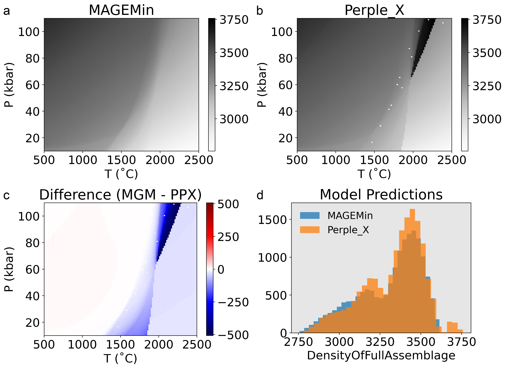

# Introduction

## Mantle Transition Zones

The dominant mineral phases in Earth's mantle are olivine, ringwoodite, bridgmanite, and ferropericlase [@ringwood1975; @ringwood1991]. Depending on the assumed mantle composition [e.g., @green1979; @ringwood1962; @jagoutz1979; @sun1982], these four phases alone may comprise up to 60–90% of the mantle [@stixrude2012]. Work since the 1950's has established that a series of discrete phase changes near 410 km and 660 km depth ([Equation @eq:mantle-transitions]) define critical mantle transition zones (MTZs) where physical properties of the mantle abruptly change [e.g, density, elasticity, etc., @ishii2018; @ita1992; @ito1989a]. While the physio-chemical nature of MTZs are continuously under investigation [@goes2022; @pearson2014; @yoshino2008; @waszek2021; @kiseeva2018; @fei2017; @zhou2022], it is widely accepted that mantle convection, melting, and plate tectonics are strongly impacted by MTZs [@fukao2001; @ringwood1991; @schubert1975; @li2019; @kuritani2019; @karato2001; @wang2015; @yang2020]. Thus, numerical geodynamic models that lack MTZs are only limited first-order approximations of mantle convection, melting, and plate tectonics.

\begin{align}\label{eq:mantle-transitions}
	\text{olivine} \xrightarrow{\text{410 transition}} \text{ringwoodite} &\xrightarrow{\text{660 transition}} \text{bridgmanite} + \text{ferropericlase} \\
	\text{(Mg,Fe)}_{2}\text{SiO}_{4} \xrightarrow{\text{410 transition}} \text{(Mg,Fe)}_{2}\text{SiO}_{4} &\xrightarrow{\text{660 transition}} \text{(Mg,Fe)}\text{SiO}_{3} + \text{(Mg,Fe)}\text{O}
\end{align}

## Current Limitations

Even with the simplest parameterizations, however, full coupling of pressure-temperature-composition-time (PTXt)-dependent phase changes with large-scale geodynamic models has been intractable because current Gibbs free energy minimization programs [GFEMs, @connolly2009; @riel2022] are slow to converge on stable solutions. For example, it could take more than 75 hours to compute phase transitions for a single timestep during a geodynamic simulation---assuming a 2D mesh resolution of 900x300 and a 1-second computation time for GFEM at each node (see [Figure @fig:benchmark-comp-times] and [Table @tbl:benchmark-comp-times-table]). Although recent work to parallelize GFEM [@riel2022] has increased GFEM efficiency dramatically ([Figure @fig:benchmark-comp-times]), directly coupling GFEM algorithms to geodynamic codes requires GFEM efficiency on the order of milliseconds to be feasible, or alternatively, applying parallelization to thousands of cores. This rate of improvement seems unlikely within the current GFEM paradigm and gaining access to many GPUs or thousands of CPU cores is inaccessible in many cases.

![Benchmark results for programs MAGEMin and Perple_X. Note that MAGEMin was ran in parallel on 6 CPU cores, while Perple_X has no parallel capabilities. In the best case, GFEM takes 124 seconds (see [Table @tbl:benchmark-comp-times-table] in [Appendix @sec:appendix-benchmark-comp-times]).](assets/figs/benchmark-comp-times.png){#fig:benchmark-comp-times width=100%}

## Hypothesis Statement

To overcome the intractability of coupling PTXt-dependent phase changes with large-scale geodynamic simulations, we propose a novel approach to inferring PTXt-dependent phase changes using machine learning (ML). We hypothesize that pre-trained neural networks can improve efficiency by up to 3 orders of magnitude vs. GFEM for predicting PTXt-dependent phase changes in the mantle. If true, directly coupling PTXt-dependent phase changes with large-scale geodynamic simulations will be feasible---enabling new insights into tectonic plates and mantle plume interactions near MTZs. Moreover, training neural networks is generalizable to other datasets, thus demonstrating success in our proposed use-case has potential for adoption to other computationally-intensive models of Earth processes in the atmosphere, hydrosphere, biosphere and geosphere. If false, however, new paradigms for directly coupling PTXt-dependent phase changes with large-scale geodynamic simulations will need to be reconsidered.

# Computing a Database of Mineral Assemblages and Rock Properties in the Mantle

## PT Conditions in the Upper Mantle

High-pressure experiments conducted since the 1990s demonstrate the reaction $\text{ringwoodite} \leftrightarrow \text{bridgmanite} + \text{ferropericlase}$ occurs at pressures coinciding with the 660 km discontinuity in the upper mantle (23.4 ± 0.05 GPa) and 1900-2000 K [@ito1989a; @ito1989b; @ishii2018]. Our MAD training datasets are thus computed across 1.0–24.0 GPa (10–240 kbar) and 773–2273 K (500–2000 ˚C). This PT range encompasses expected mantle transition PTs, as well as conditions that occur in subduction zone and mantle-plume settings (???cite).

## Bulk Composition of the Upper Mantle

| Sample &nbsp; &nbsp; | SiO$_2$ | Al$_2$O$_3$ |   CaO |   MgO |  FeO | K$_2$O | Na$_2$O | TiO$_2$ |   O$_2$ | Cr$_2$O$_3$ | &nbsp; &nbsp; &nbsp; &nbsp; Reference |
|:---------------------|--------:|------------:|------:|------:|-----:|-------:|--------:|--------:|--------:|------------:|--------------------------------------:|
| PUM                  |   44.90 |        4.44 |  3.54 | 37.71 | 8.03 |  0.029 |    0.36 |    0.20 |    0.01 |        0.38 |                              @sun1989 |
| DMM                  |   44.71 |        3.98 |  3.17 | 38.73 | 8.18 |  0.006 |    0.13 |    0.13 |    0.01 |        0.57 |                          @workman2005 |
| RE46                 |   50.72 |        9.16 | 15.21 | 16.25 | 7.06 |  0.010 |    1.47 |    0.39 |    0.35 |        0.01 |                             @yang1996 |
| NMORB                |   53.21 |        9.41 | 12.21 | 12.21 | 8.65 |  0.090 |    2.90 |    1.21 |    0.69 |        0.02 |                             @gale2013 |

: Estimated bulk compositions (in wt. % oxides) for the mantle. {#tbl:benchmark-samples}

{#fig:benchmark-density}

# References

# Appendix

## Gibbs Free Energy Minimization Benchmarking Results {#sec:appendix-benchmark-comp-times}

Estimated bulk compositions for primitive and depleted mantle rocks ([Table @tbl:benchmark-samples]) were used for benchmarking GFEM programs [MAGEMin](https://github.com/ComputationalThermodynamics/MAGEMin) and [Perple_X](https://github.com/ondrolexa/Perple_X) [@riel2022; @connolly2009]. [Table @tbl:benchmark-comp-times-table] shows the computation times with respect to various PT grid resolutions (8x8, 16x16, 32x32, 64x64, 128x128). All computations were made on a Macbook Pro (2022; M2 chip) with macOS 13.4 and Python 3.11.4. Note that MAGEMin was ran on 6 CPU cores in parallel, while Perple_X does not have parallel capabilities.

| Sample | PT Grid Size |  MAGEMin (s) | Perple_X (s)  | Perple_X/MAGEMin |
|:-------|-------------:|-------------:|--------------:|-----------------:|
| DMM    |           64 |          1.9 |          17.1 |              9.0 |
| NMORB  |           64 |          1.3 |          21.2 |             16.3 |
| PUM    |           64 |          0.7 |          18.8 |             26.8 |
| RE46   |           64 |          5.0 |          22.1 |              4.4 |
| DMM    |          256 |          3.4 |          63.0 |             18.5 |
| NMORB  |          256 |          3.9 |          79.1 |             20.2 |
| PUM    |          256 |          2.0 |          65.3 |             32.6 |
| RE46   |          256 |         15.0 |          82.2 |              5.4 |
| DMM    |         1024 |          9.1 |          229.8|             25.2 |
| NMORB  |         1024 |         13.8 |          264.7|             19.1 |
| PUM    |         1024 |          7.7 |          245.2|             31.8 |
| RE46   |         1024 |         55.4 |          283.4|              5.1 |
| DMM    |         4096 |         33.0 |         847.4 |             25.7 |
| NMORB  |         4096 |         54.9 |         995.9 |             18.1 |
| PUM    |         4096 |         29.7 |         922.1 |             31.0 |
| RE46   |         4096 |        201.8 |        1036.1 |              5.1 |
| DMM    |        16384 |        128.9 |        3381.2 |             26.2 |
| NMORB  |        16384 |        211.7 |        3827.6 |             18.1 |
| PUM    |        16384 |        115.4 |        3672.7 |             31.8 |
| RE46   |        16384 |        774.4 |        4102.7 |              5.3 |

: Computation times for various bulk mantle compositions. {#tbl:benchmark-comp-times-table}

# Extra

| Mineral        | Formula                                                            | &nbsp; &nbsp; Structure | &nbsp; &nbsp; Density (g/cm$^3$) | &nbsp; &nbsp; % transition |
|:---------------|-------------------------------------------------------------------:|------------------------:|---------------------------------:|---------------------------:|
| Plagioclase    | $(\text{Ca},\text{Na})(\text{Al},\text{Si})_2\text{O}_8$           | Triclinic               | 2.69                             |                     0–10/0 |
| Orthopyroxene  | $(\text{Mg},\text{Fe})_{2}\text{Si}_2\text{O}_6$                   | Monoclinic              | 3.20                             |                     0–20/0 |
| Olivine        | $(\text{Mg},\text{Fe})_{2}\text{SiO}_4$                            | Orthorhombic            | 3.27                             |                    60-80/0 |
| Clinopyroxene  | $(\text{Mg},\text{Fe},\text{Ca})(\text{Si},\text{Al})_2\text{O}_6$ | Monoclinic              | 3.40                             |                     0–18/0 |
| Garnet         | $(\text{Mg},\text{Fe})_{3}\text{Al}_2\text{Si}_3\text{O}_{12}$     | Cubic                   | 3.58                             |                     0–40/0 |
| Spinel         | $\text{MgAl}_2\text{O}_4$                                          | Cubic                   | 3.64                             |                      0–1/0 |
| Ferropericlase | $(\text{Mg},\text{Fe})\text{O}$                                    | Cubic                   | 3.78                             |                    0/72–76 |
| Wadsleyite     | $(\text{Mg},\text{Fe})_{2}\text{SiO}_4$                            | Orthorhombic            | 3.84                             |                    60-80/0 |
| Ringwoodite    | $(\text{Mg},\text{Fe})_{2}\text{SiO}_4$                            | Cubic                   | 3.90                             |                    60-80/0 |
| Bridgmanite    | $(\text{Mg},\text{Fe})\text{SiO}_3$                                | Perovskite              | 4.10                             |                    0/18–22 |

: Ambient Mg-rich densities of mantle minerals [@stixrude2012]. {#tbl:mantle-minerals}

