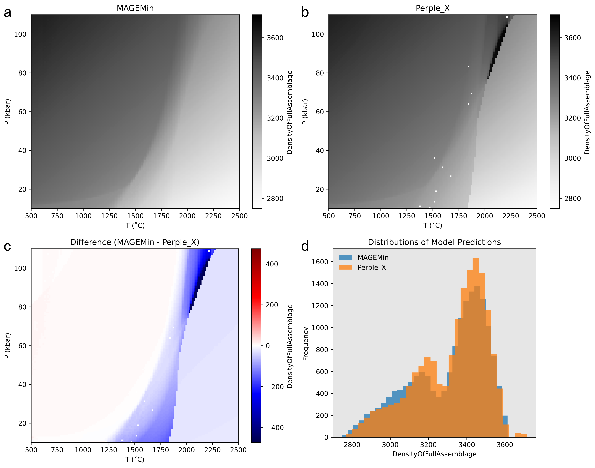

# Introduction

## Computational Limitations for Computing Phase Changes in the Mantle
Assuming a pyrolitic composition for Earth's mantle [e.g., @green1979; @jagoutz1979; @sun1982], the dominant mineral phases between the Moho and core-mantle boundary (~7–2900 km) are the Mg-Fe-rich minerals olivine, ringwoodite, bridgmanite, and ferropericlase [@ringwood1991; @stixrude2012]. These phases alone may comprise up to 60–90% of the mineral assemblage in the mantle [@stixrude2012]. As pressure increases with depth, a series of discrete phase changes to higher-density mineral assemblages occur ([Equation @eq:mantle-transitions; Table @tbl:mantle-minerals]) that define transition zones in the mantle [@ishii2018] and strongly impact the dynamics of mantle convection and plate tectonics [e.g., @ringwood1991]. It is therefore critical to approximate phase changes in large-scale geodynamic codes that simulate mantle convection and plate tectonics.

\begin{align}\label{eq:mantle-transitions}
	\text{olivine} \xrightarrow{\text{410 transition}} \text{ringwoodite} &\xrightarrow{\text{660 transition}} \text{bridgmanite} + \text{ferropericlase} \\
	\text{(Mg,Fe)}_{2}\text{SiO}_{4} \xrightarrow{\text{410 transition}} \text{(Mg,Fe)}_{2}\text{SiO}_{4} &\xrightarrow{\text{660 transition}} \text{(Mg,Fe)}\text{SiO}_{3} + \text{(Mg,Fe)}\text{O}
\end{align}

| Mineral        | Formula                                                            | &nbsp; &nbsp; Structure | &nbsp; &nbsp; Density g/cm$^3$ | &nbsp; &nbsp; % $\leq$ 660 | &nbsp; &nbsp; % > 660 |
|:---------------|-------------------------------------------------------------------:|------------------------:|-------------------------------:|---------------------------:|----------------------:|
| Plagioclase    | $(\text{Ca},\text{Na})(\text{Al},\text{Si})_2\text{O}_8$           | Triclinic               | 2.69                           |                            |                       |
| Orthopyroxene  | $(\text{Mg},\text{Fe})_{2}\text{Si}_2\text{O}_6$                   | Monoclinic              | 3.20                           |                            |                       |
| Clinopyroxene  | $(\text{Mg},\text{Fe},\text{Ca})(\text{Si},\text{Al})_2\text{O}_6$ | Monoclinic              | 3.40                           |                            |                       |
| Garnet         | $(\text{Mg},\text{Fe})_{3}\text{Al}_2\text{Si}_3\text{O}_{12}$     | Cubic                   | 3.75                           |                            |                       |
| Spinel         | $\text{MgAl}_2\text{O}_4$                                          | Cubic                   | 3.65                           |                            |                       |
| Olivine        | $(\text{Mg},\text{Fe})_{2}\text{SiO}_4$                            | Orthorhombic            | 3.32                           |                            |                       |
| Wadsleyite     | $(\text{Mg},\text{Fe})_{2}\text{SiO}_4$                            | Orthorhombic            | 3.84                           |                            |                       |
| Bridgmanite    | $(\text{Mg},\text{Fe})\text{SiO}_3$                                | Perovskite              | 4.10                           |                            |                       |
| Ferropericlase | $(\text{Mg},\text{Fe})\text{O}$                                    | Cubic                   | 3.79                           |                            |                       |

: Modes and densities of abundant mantle minerals [@stixrude2012]. {#tbl:mantle-minerals}

Even with the simplest parameterizations, however, implementing pressure-temperature-composition-time (PTXt)-dependent phase changes has been intractable for large-scale geodynamic models because current Gibbs free energy minimization (GFEM) algorithms are computationally expensive and slow to converge on stable solutions ([Figure @fig:benchmark-comp-times]). For example, it could take more than 75 hours to compute phase transitions for a single timestep during a geodynamic simulation---assuming a 2D mesh resolution of 900x300 and a 1-second computation time for GFEM at each node (a generous estimate, see [Figure @fig:benchmark-comp-times]). Although recent work to parallelize GFEM [@riel2022] has decreased computation times dramatically ([Figure @fig:benchmark-comp-times]), directly coupling GFEM algorithms to geodynamic codes would require computation times on the order of milliseconds or applying parallelization to thousands of cores to be feasible (i.e. a few minutes for a single timestep on a 900x300 resolution mesh). This rate of improvement seems unlikely within the current GFEM paradigm and widespread use of such a tool is unlikely if it requires access to many GPUs or thousands of CPU cores.

To overcome the intractability of implementing PTXt-dependent phase changes in large-scale geodynamic simulations, we propose a novel approach using machine learning (ML) algorithms. We hypothesize that our alternative approach will improve computational efficiency by up to 3 orders of magnitude beyond the state-of-the-art for a range of realistic mantle conditions and rock compositions. Moreover, our proposed approach for improving computational efficiency is generalizable to other datasets, and thus has potential for scaling other computationally-intensive models of Earth processes in the atmosphere, hydrosphere, biosphere and geosphere.

![Benchmark results for programs MAGEMin and Perple_X. Note that MAGEMin was ran in parallel on 6 CPU cores, while Perple_X has no parallel capabilities. In the best case, GFEM takes 124 seconds (see [Table @tbl:benchmark-comp-times-table] in [Appendix @sec:appendix-benchmark-comp-times]).](assets/images/notes/benchmark-comp-times.png){#fig:benchmark-comp-times width=75%}

# Computing a Database of Mineral Assemblages and Rock Properties in the Mantle

### Gibbs Free Energy Minimization Benchmarking Results

Samples of various primitive and evolved mantle compositions ([Table @tbl:benchmark-samples]) were used for benchmarking GFEM algorithms implemented in the programs [MAGEMin](https://github.com/ComputationalThermodynamics/MAGEMin) and [Perple_X](https://github.com/ondrolexa/Perple_X) [@riel2022; @connolly2009]. [Table @tbl:benchmark-comp-times-table] in [Appendix @sec:appendix-benchmark-comp-times] shows the benchmarking results in terms of computation times. All computations were made on a Macbook Pro (2022; M2 chip) with macOS 13.4 and Python 3.11.4. Note that MAGEMin was ran on 6 CPU cores in parallel, while Perple_X does not have parallel capabilities.

| Sample | SiO$_2$ | Al$_2$O$_3$ |   CaO |   MgO |  FeO | K$_2$O | Na$_2$O | TiO$_2$ |   O$_2$ | Cr$_2$O$_3$ |      Reference |
|:-------|--------:|------------:|------:|------:|-----:|-------:|--------:|--------:|--------:|------------:|---------------:|
| PUM    |   44.9  |        4.44 |  3.54 | 37.71 | 8.03 |  0.029 |    0.36 |    0.2  |    0.01 |        0.38 |       @sun1989 |
| DMM    |   44.71 |        3.98 |  3.17 | 38.73 | 8.18 |  0.006 |    0.13 |    0.13 |    0.01 |        0.57 |   @workman2005 |
| RE46   |   50.72 |        9.16 | 15.21 | 16.25 | 7.06 |  0.010 |    1.47 |    0.39 |    0.35 |        0.01 |      @yang1996 |
| NMORB  |   53.21 |        9.41 | 12.21 | 12.21 | 8.65 |  0.090 |    2.90 |    1.21 |    0.69 |        0.02 |      @gale2013 |

: Sample compositions (in wt. % oxides) for benchmarking. {#tbl:benchmark-samples}

## PT Conditions in the Upper Mantle

The PT conditions for this inferred transition are estimated at 23.4 GPa and between 1900–2000 K from experiments and 

## Bulk Compositions of the Upper Mantle

# References

# Appendix

## Gibbs Free Energy Minimization Benchmarking Results {#sec:appendix-benchmark-comp-times}

| Method  | Sample | PT Grid Resolution | Time (s) |
|:--------|:-------|-------------------:|---------:|
| magemin | DMM    |                8x8 |      1.9 |
| magemin | DMM    |              16x16 |      3.4 |
| magemin | DMM    |              24x24 |      5.8 |
| magemin | DMM    |              32x32 |      8.9 |
| magemin | DMM    |              48x48 |     19.2 |
| magemin | DMM    |              64x64 |     32.2 |
| magemin | DMM    |              96x96 |     76.9 |
| magemin | DMM    |            128x128 |    128.4 |
| perplex | DMM    |                8x8 |     12.7 |
| perplex | DMM    |              16x16 |     56.9 |
| perplex | DMM    |              24x24 |    124.6 |
| perplex | DMM    |              32x32 |    210.5 |
| perplex | DMM    |              48x48 |    474.6 |
| perplex | DMM    |              64x64 |    819.2 |
| perplex | DMM    |              96x96 |   1874.2 |
| perplex | DMM    |            128x128 |   3321.7 |
| magemin | NMORB  |                8x8 |      1.3 |
| magemin | NMORB  |              16x16 |      3.9 |
| magemin | NMORB  |              24x24 |      8.1 |
| magemin | NMORB  |              32x32 |     13.7 |
| magemin | NMORB  |              48x48 |     30.5 |
| magemin | NMORB  |              64x64 |     52.9 |
| magemin | NMORB  |              96x96 |    130.2 |
| magemin | NMORB  |            128x128 |    211.5 |
| perplex | NMORB  |                8x8 |     16.5 |
| perplex | NMORB  |              16x16 |     68.3 |
| perplex | NMORB  |              24x24 |    143.1 |
| perplex | NMORB  |              32x32 |    249.9 |
| perplex | NMORB  |              48x48 |    560.6 |
| perplex | NMORB  |              64x64 |    971.4 |
| perplex | NMORB  |              96x96 |   2147.8 |
| perplex | NMORB  |            128x128 |   3784.6 |
| magemin | PUM    |                8x8 |      0.7 |
| magemin | PUM    |              16x16 |      2.0 |
| magemin | PUM    |              24x24 |      4.3 |
| magemin | PUM    |              32x32 |      7.5 |
| magemin | PUM    |              48x48 |     17.5 |
| magemin | PUM    |              64x64 |     30.1 |
| magemin | PUM    |              96x96 |     66.0 |
| magemin | PUM    |            128x128 |    124.5 |
| perplex | PUM    |                8x8 |     14.9 |
| perplex | PUM    |              16x16 |     59.7 |
| perplex | PUM    |              24x24 |    134.6 |
| perplex | PUM    |              32x32 |    228.4 |
| perplex | PUM    |              48x48 |    518.3 |
| perplex | PUM    |              64x64 |    895.2 |
| perplex | PUM    |              96x96 |   2008.6 |
| perplex | PUM    |            128x128 |   3594.6 |
| magemin | RE46   |                8x8 |      4.9 |
| magemin | RE46   |              16x16 |     14.8 |
| magemin | RE46   |              24x24 |     29.2 |
| magemin | RE46   |              32x32 |     54.7 |
| magemin | RE46   |              48x48 |    113.5 |
| magemin | RE46   |              64x64 |    201.7 |
| magemin | RE46   |              96x96 |    473.0 |
| magemin | RE46   |            128x128 |    800.1 |
| perplex | RE46   |                8x8 |     17.5 |
| perplex | RE46   |              16x16 |     70.6 |
| perplex | RE46   |              24x24 |    152.5 |
| perplex | RE46   |              32x32 |    268.0 |
| perplex | RE46   |              48x48 |    588.1 |
| perplex | RE46   |              64x64 |   1027.0 |
| perplex | RE46   |              96x96 |   2375.6 |
| perplex | RE46   |            128x128 |   4073.3 |

: Benchmark computation times. {#tbl:benchmark-comp-times-table}
