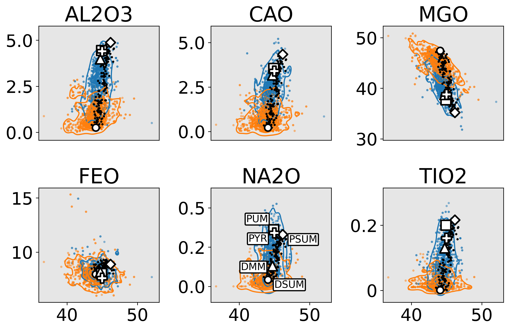
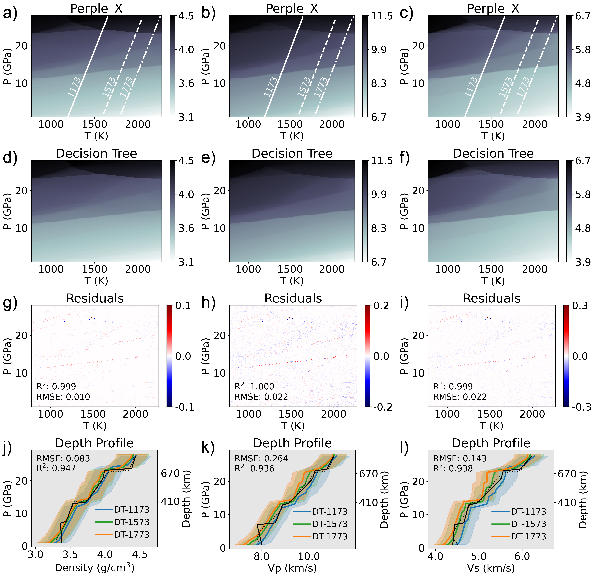
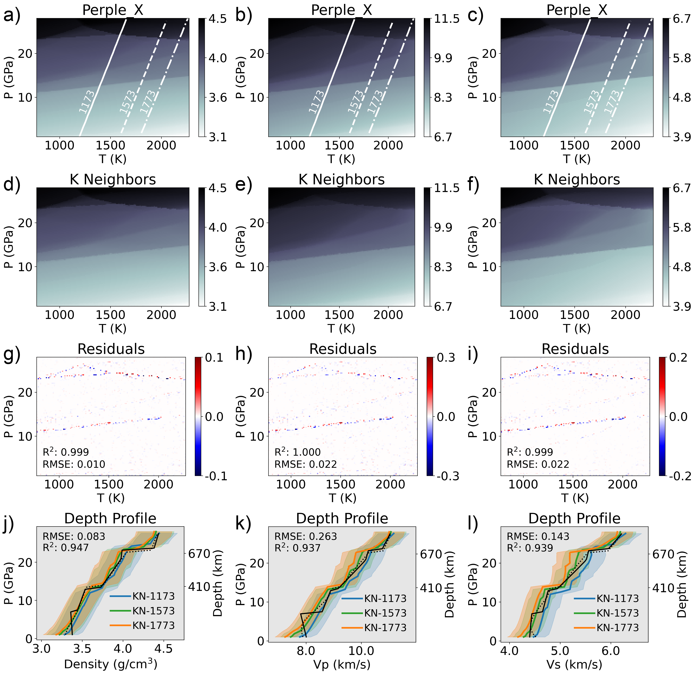
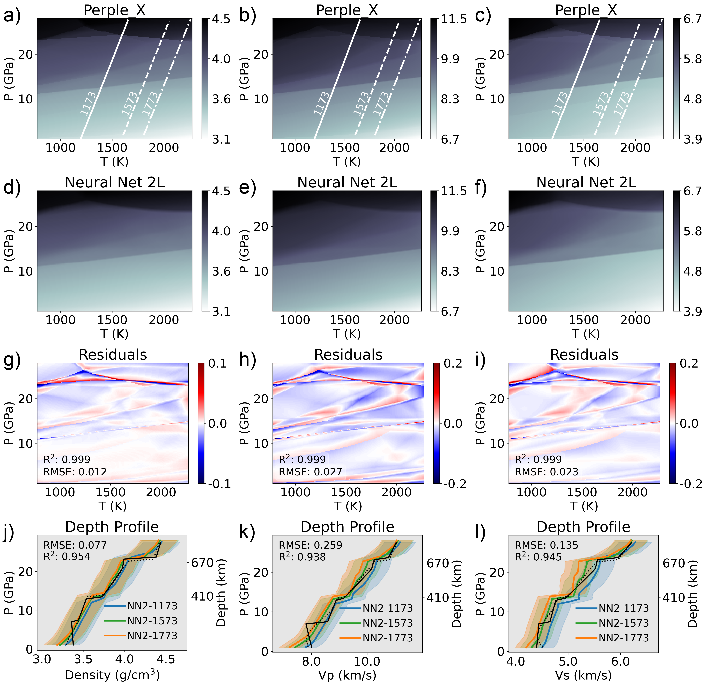
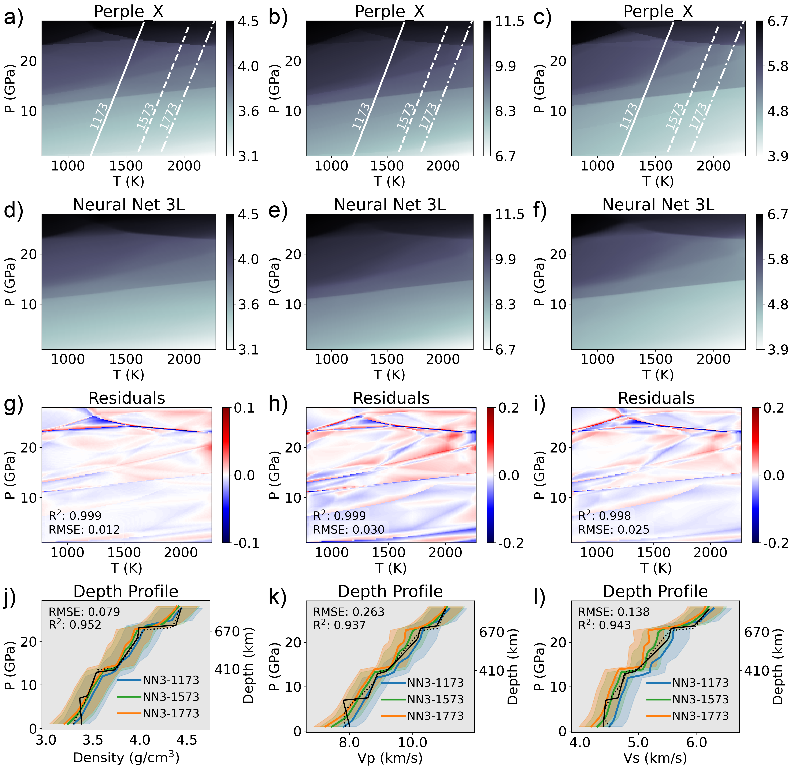

```{r echo=FALSE}
knitr::opts_chunk$set(echo=F, message=F, warning=F, fig.pos='htbp', out.extra='', fig.align='center', out.width='100%')

suppressMessages({library(knitr)})
```

# Contents of this File {-}

1. Figures \@ref(fig:earthchem-harker-diagram) to \@ref(fig:image12-PUM-NN3)
2. Tables S1

\clearpage

# Synthetic Peridotite Compositions {-}

Figure \@ref(fig:earthchem-harker-diagram) shows a comparison between natural peridotite compositions in the standardized Earthchem.org dataset and synthetic peridotite compositions sampled randomly along the PCA mixing array as described in Section 2.1.2 of the main text. The data in Figure \@ref(fig:earthchem-harker-diagram) are the same as presented in Figure 2 of the main text, but show peridotite compositions in chemical space (Harker diagrams vs. SiO$_2$) instead of PC space. The trend from more fertile lherzolite samples to more depleted harzburgite samples is closely approximated by the synthetic peridotite mixing array. While PUM and DMM are often represented in the literature as distinct mantle end-members, they have quite similar major oxide compositions (e.g., Al$_2$O$_3$, CaO, MgO, and FeO). Synthetic mantle end-members PSUM and DSUM represent a much wider range of recorded mantle compositions than PUM and DMM (Figure \@ref(fig:earthchem-harker-diagram)).

(ref:earthchem-harker-diagram-cap) Harker Diagrams vs. SIO2 (in wt.%) showing the distribution of peridotite samples from Earthchem.org (colored data points and contours). PUM (white square), DMM (white triangle), and pyrolite (white plus) are commonly-referenced bulk mantle compositions (see Table 2 in the main text), while PSUM (white diamond) and DSUM (white circle) define a mixing array used to generate RocMLM training data (black data points).

```{r earthchem-harker-diagram, fig.cap='(ref:earthchem-harker-diagram-cap)'}

```

\clearpage

# RocMLM Regression Algorithms {-}

Figures \@ref(fig:image12-PUM-DT)–\@ref(fig:image12-PUM-NN3) show RocMLM predictions and depth profiles for a PUM bulk mantle composition. The Decision Tree, single-layer Neural Network, and three-layer Neural Network RocMLMs were presented in the main text (Figures 3–5), while the k-Neighbors (Figure \@ref(fig:image12-PUM-KN)) and two-layer Neural Network RocMLMs (Figures \@ref(fig:image12-PUM-NN2)) are presented here for a comprehensive comparison of all the regression algorithms tested in this study.

(ref:image-12-PUM-DT-cap) PT diagrams showing density (left column, g/cm3), Vp (middle column, km/s), and Vs (right column, km/s) predictions from a Perple_X model with a PUM bulk composition (a–c), a Decision Tree RocMLM (d–f), and absolute differences between Perple_X and DT (g–i) measured on the validation dataset. Other legend details are the same as in Figure 3 of the main text.

```{r image12-PUM-DT, fig.cap='(ref:image12-PUM-DT-cap)'}

```

(ref:image-12-PUM-KN-cap) PT diagrams showing density (left column, g/cm3), Vp (middle column, km/s), and Vs (right column, km/s) predictions from a Perple_X model with a PUM bulk composition (a–c), a k-Neighbors RocMLM (d–f), and absolute differences between Perple_X and KN (g–i) measured on the validation dataset. Other legend details are the same as in Figure 3 of the main text.

```{r image12-PUM-KN, fig.cap='(ref:image12-PUM-KN-cap)'}

```

(ref:image-12-PUM-NN1-cap) PT diagrams showing density (left column, g/cm3), Vp (middle column, km/s), and Vs (right column, km/s) predictions from a Perple_X model with a PUM bulk composition (a–c), a single-layer Neural Network RocMLM (d–f), and absolute differences between Perple_X and NN1 (g–i) measured on the validation dataset. Other legend details are the same as in Figure 3 of the main text.

```{r image12-PUM-NN1, fig.cap='(ref:image12-PUM-NN1-cap)'}
include_graphics('image12-PUM-NN1.png')
```

(ref:image-12-PUM-NN2-cap) PT diagrams showing density (left column, g/cm3), Vp (middle column, km/s), and Vs (right column, km/s) predictions from a Perple_X model with a PUM bulk composition (a–c), a two-layer Neural Network RocMLM (d–f), and absolute differences between Perple_X and NN2 (g–i) measured on the validation dataset. Other legend details are the same as in Figure 3 of the main text.

```{r image12-PUM-NN2, fig.cap='(ref:image12-PUM-NN2-cap)'}

```

(ref:image-12-PUM-NN3-cap) PT diagrams showing density (left column, g/cm3), Vp (middle column, km/s), and Vs (right column, km/s) predictions from a Perple_X model with a PUM bulk composition (a–c), a three-layer Neural Network RocMLM (d–f), and absolute differences between Perple_X and NN3 (g–i) measured on the validation dataset. Other legend details are the same as in Figure 3 of the main text.

```{r image12-PUM-NN3, fig.cap='(ref:image12-PUM-NN3-cap)'}

```

\clearpage

# GFEM, Lookup Table, and RocMLM Performance Datasets {-}

The Lookup Table and GFEM performance data referenced in the main text are not included here for brevity, but can be found at https://doi.org/10.17605/OSF.IO/K23TB. These data are shown in Figure 6 of the main text and referenced in the Introduction of the main text to give a sense of the execution speeds of widely-used GFEM programs (4–228 ms per PTX point). The Introduction of the main text also references a feasibility objective for RocMLM performance (10$^0$–10$^{−1}$ ms), which was estimated with the following reasoning. Numerical geodynamic models on the order of 2000 x 300 km in scale, containing at least 277,221 nodes [921 x 301\, e.g., @kerswell2021] are widely-considered “high-resolution”. Running GFEM on each node (at 4–228 ms/node) would take between 18.5 minutes to 17.5 hours with modern GFEM programs, depending on their configuration and assuming a simple sequential computation. At execution speeds of 10$^0$–10$^{−1}$ ms, however, only 0.5–4.5 minutes of computation time would be added to each timestep, in a similar context. We consider an additional 0.5–4.5 minutes per timestep reasonable considering the advantage of implementing thermodynamic self-consistency in numerical experiments, especially given that parallel computing would further decrease these time estimations. We therefore set 10$^0$–10$^{−1}$ ms as a minimum feasibility objective for RocMLM execution speeds. 

Note that Figure 6 of the main text shows a representative subset of the RocMLM performance data evaluated in this study. RocMLM performance was measured multiple times for each regression algorithm: iterating over all combinations of PT and X resolutions (Table \@ref(tab:rocmlm-performance)), or model “capacities”, which was too much data to include in the main text. For graphical clarity, Figure 6 of the main text only shows the set of RocMLM models with the lowest prediction times for each unique model capacity (ranging from 2$^{11}$–2$^{21}$). The same filtering procedure is equally applied to Lookup Table results. Removing this filtering step (or alternatively selecting for the highest prediction times) does not alter the main conclusions discussed in Section 4 of the main text, but does make the results presented in Figure 6 of the main text easier to digest for the reader. For transparency and reproducibility, the complete RocMLM performance dataset is contained in Table \@ref(tab:rocmlm-performance) below.

Table: (\#tab:rocmlm-performance) RocMLM PTX resolution, accuracy (RMSE vs. Perple_X), and performance (training and prediction times) measured on a validation dataset after training.

```{r rocmlm-performance, child='rocmlm-performance.md'}
```

\clearpage

<div id="refs"></div>

\cleardoublepage
